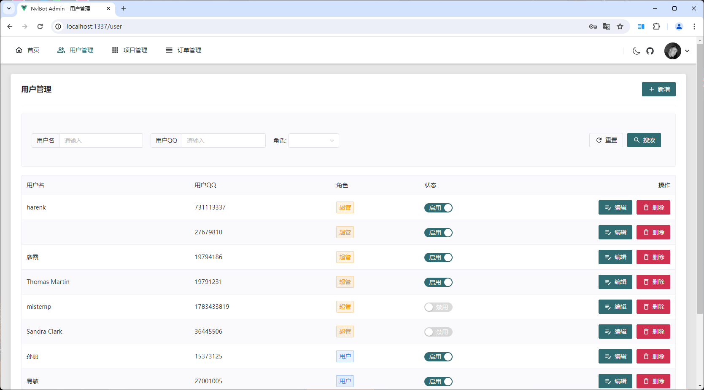
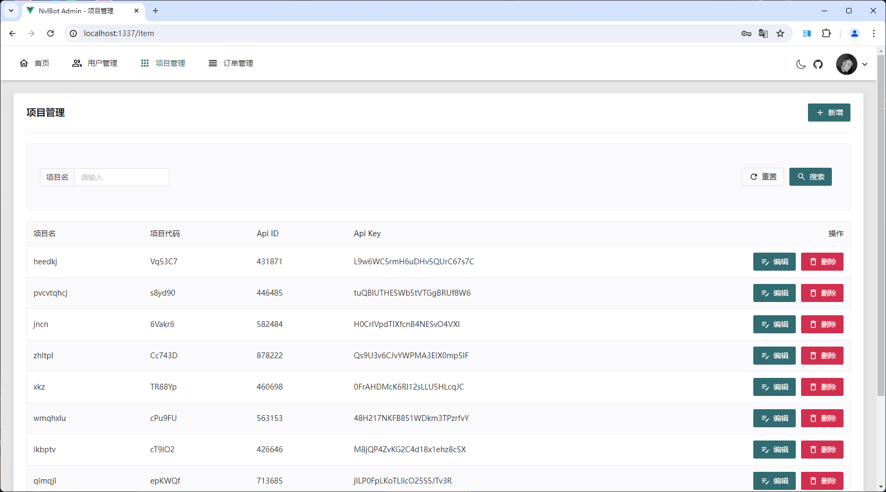

## 项目介绍

一个通过 QQ 机器人实现 Neverlose 市场物品推送绑定的项目，自带后台管理页面。

后端 Spring Boot3 + Sqlite + [Shiro](https://github.com/MisakaTAT/Shiro)

前端 Vue3 + Naive UI
👉[点我跳转前端仓库]()

OneBot实现: [NapCatQQ](https://github.com/NapNeko/NapCatQQ)

## 项目环境

* JDK17

## 如何使用

参考 [NapCatQQ 使用文档](https://napneko.github.io/zh-CN/guide/getting-started) 安装 NapCatQQ

**注意：** urls里配置的 127.0.0.1 改为你部署本项目的服务器 IP, 如果 NapCatQQ 和本项目部署在同一服务器下则不用修改。
<details>
<summary>NapCatQQ 配置如下</summary>

```json
{
  "http": {
    "enable": false,
    "host": "",
    "port": 3000,
    "secret": "",
    "enableHeart": false,
    "enablePost": false,
    "postUrls": []
  },
  "ws": {
    "enable": false,
    "host": "",
    "port": 3001
  },
  "reverseWs": {
    "enable": true,
    "urls": [
      "ws://127.0.0.1:1337/onebot/v11/ws"
    ]
  },
  "debug": false,
  "heartInterval": 60000,
  "messagePostFormat": "array",
  "enableLocalFile2Url": false,
  "musicSignUrl": "",
  "reportSelfMessage": false,
  "token": "",
  "GroupLocalTime": {
    "Record": false,
    "RecordList": []
  }
}
```
</details>

## Windows

1. 前往 [Release](https://github.com/harenk1337/nvl-bot/releases/) 页面下载项目最新版本
2. 确保 `app.jar` 和 `database.db` 在同一目录下
3. 当前目录打开 CMD 窗口输入 `java -jar app.jar` 启动项目

## Linux

Linux 环境推荐使用 Docker 来安装, 无需手动安装环境

[DockerHub](https://hub.docker.com/r/harenk99/nvl-bot)

<details>
<summary>点我查看 Docker 部署👈</summary>

### Docker

1. 前往 [Release](https://github.com/harenk1337/nvl-bot/releases/) 页面下载项目最新版本
2. 确保 `app.jar` 和 `database.db` 在同一目录下
3. 同一目录下新建 `Dockerfile`，内容如下

```dockerfile
FROM todocoder/jre:17
LABEL authors="harenk"
WORKDIR /opt

ARG PORT=1337
EXPOSE ${PORT}

ENV APP_BASE_URL="http://localhost:${PORT}/api"
ENV APP_ARGS="-XX:+UseG1GC -Xms1024m -Xmx1024m -Xss256k -XX:MetaspaceSize=128m"

COPY ./app.jar app.jar
COPY ./database.db database.db

ENTRYPOINT ["java", "-jar", "app.jar", "${APP_ARGS}", "-c"]

```
分别运行以下命令
```shell
docker build -t nvl-bot .
```
```shell
docker run -d \
-p 1337:1337 \
--restart=always \
--volume /opt/nvl-bot/database.db:/opt/database.db \
--name nvl-bot nvl-bot
```

</details>


<details>
<summary>点我查看 Docker Compose 部署👈</summary>


### Docker Compose

新建 `docker-compose.yaml` 文件

**注意:** 你需要把 `<QQ号>` 更改为你需要作为 Bot 登录的 QQ号
<details>
<summary>Docker Compose 内容</summary>

```yaml
version: '3.9'
services:
  napcat:
    container_name: napcat
    image: mlikiowa/napcat-docker:latest
    environment:
      ACCOUNT: <QQ号>
      WSR_ENABLE: true
      WS_URLS: '["ws://nvl-bot:1337/onebot/v11/ws"]'
    volumes:
      - /opt/napcat/config:/usr/src/app/napcat/config
    ports:
      - "6099:6099"
    restart: always
    depends_on:
      - bot
    networks:
      - nvl-bot

  bot:
    container_name: nvl-bot
    image: harenk99/nvl-bot:1.0
    volumes:
      - /opt/nvl-bot/database.db:/opt/database.db
    ports:
      - "1337:1337"
    restart: always
    networks:
      - nvl-bot


networks:
  nvl-bot:
    name: nvl-bot
    driver: bridge
```

</details>

运行以下命令, 等待启动后扫码登录即可

```shell
docker-compose up -d && docker logs -f napcat
```

</details>

## 后台地址

[http://127.0.0.1:1337/](http://127.0.0.1:1337/)

<details>
<summary>后台管理页面</summary>





</details>

## 机器人指令

<details>
<summary>点我查看机器人指令👈</summary>

```text
以下所有命令以 .开头, 例如 .查用户
括号内的参数为必填，中括号为选填，冒号后面为不填的默认值

1、菜单 -> 显示本菜单
2、查用户 -> 查询所有可使用本 Bot 的用户
3、查项目 -> 查询当前所有项目
4、绑定 (NL 账号) (项目名) -> 推送项目给所输入的 NL 账号
5、添加用户 (用户 QQ) [用户名:未命名] -> 给用户添加 Bot 使用权限
6、启用/禁用 (用户 QQ) -> 启用/禁用 用户使用权限
```

</details>

## 鸣谢名单

[Shiro](https://github.com/MisakaTAT/Shiro)

[NapCatQQ](https://github.com/NapNeko/NapCatQQ)
