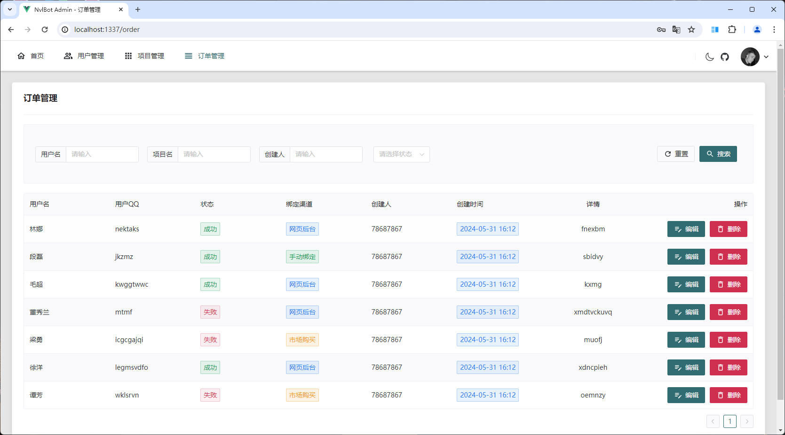

## 项目介绍

一个通过 QQ 机器人实现 Neverlose 市场物品推送绑定的项目，自带后台管理页面。

后端 Spring Boot3 + Sqlite + [Shiro](https://github.com/MisakaTAT/Shiro)

前端 Vue3 + Naive UI
👉[点我跳转前端仓库](https://github.com/harenk1337/NvlBot-Admin)

OneBot实现: [NapCatQQ](https://github.com/NapNeko/NapCatQQ)

## 如何使用

👉[点我前往官方文档](https://harenk1337.github.io/NvlBot-Docs/)
## 后台预览

后台管理页面

## 鸣谢名单

[Shiro](https://github.com/MisakaTAT/Shiro)

[NapCatQQ](https://github.com/NapNeko/NapCatQQ)
